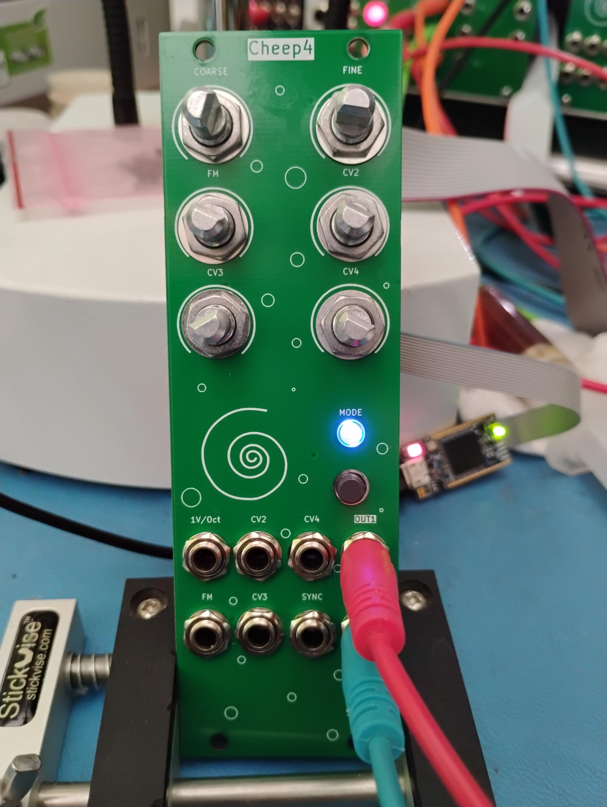
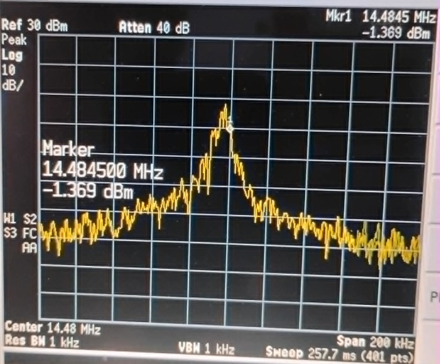
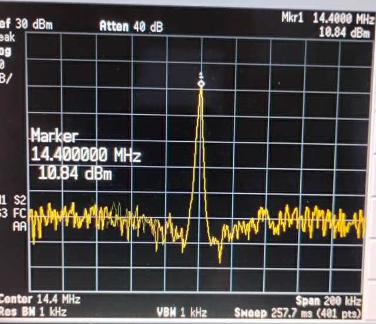

# Cheep4

Yet another Eurorack digital oscillator

## Abstract

Cheep4 is a continuation of a series of low-spec / low-cost digital oscillator modules for Eurorack whose primary purpose is to demonstrate using extreme low-end microcontrollers to do DSP. The series includes the following earlier modules:

[cheep_mod](https://github.com/emeb/Old_Website/tree/main/synth/cheep_mod) - the original stripped-down done with an STM32F030 and a SPI DAC.

[cheep2](https://github.com/emeb/Old_Website/tree/main/synth/cheep2) - 2nd generation uses an STM32F031 and a stereo I2S DAC.

[cheep3a](https://github.com/emeb/cheep3a) - 3rd generation based on a CH32V003 and stereo I2S DAC faked out with a SPI interface.

Cheep4 dials up the functionality with a more advanced MCU - the STM32C542CCT6 which although more powerful is still inexpensive (under $2) - and a decent quality I2S DAC, as well as a more complete set of controls for the 1V/Octave input (Coarse, Fine, FM pots). Similar to the cheep3a, it has a button & LED mode select interface which provides seven distinct algorithms and nonvolatile memory to save the mode across power cycles. Behind the panel there are also USB and Qwiic connectors for upgrades and expansion.

## Features

- [STM32C542CC](https://www.st.com/en/microcontrollers-microprocessors/stm32c542cc.html) MCU with
  
  - Arm Cortex M33 at 144MHz
  
  - 256kB Flash
  
  - 64kB SRAM
  
  - CORDIC math coprocessor

- [PCM5100A](https://www.ti.com/product/PCM5100A) I2S DAC

- [GD25Q32](https://www.gigadevice.com/product/flash/spi-nor-flash/gd25q32c)  4MB SPI flash memory

- USB port

- [Qwiic](https://www.sparkfun.com/qwiic) I2C port

- 16-pin shrouded Eurorack power connector with +/-12V only

- 6x 9mm potentiometers
  
  - Coarse pitch
  
  - Fine pitch
  
  - FM pitch attenuator
  
  - CV1, CV2, CV3 offsets

- 8x 3.5mm mono jacks
  
  - 1V/Oct pitch input (+/-5V range)
  
  - FM pitch input
  
  - CV1, CV2, CV3 inputs (+/-5V range)
  
  - Sync input (digital, 0.7V threshold)
  
  - 2 +/-5V outputs

- Button + RGB LED for mode selection.

## Firmware

Firmware included with this project includes test code for all the critical MCU features as well as functional oscillator applications. All code is built with my own simplified make-based system and needs only an Arm GCC compiler and an ST-Link programmer. Code is based on the ST HAL2 hardware interface library as well as the Arm CMSIS low-level drivers and register definitions, both of which are included in this repository.

### Prerequisites

- [Arm GCC compiler](https://developer.arm.com/downloads/-/arm-gnu-toolchain-downloads)

- [ST-Link programmer](https://www.st.com/en/development-tools/hardware-debugger-and-programmer-tools-for-stm32/products.html) hardware interface - currently the only low-cost programmer/debugger that interfaces to the STM32C5 family MCUs.

- [STM32 Cube Programmer]([https://www.st.com/en/development-tools/stm32cubeprog.html) application installed - needed for interfacing to ST-Link programmer hardware. 

### Building

Change directories into the desired subdirectory and run `make` - this may require editing the Makefile to point to the installation locations of you prerequisites.

## Hardware

Kicad 9.0.x design files are included for both the passive front panel and active back panel. A Libreoffice ODS spreadsheet of the Bill of Materials (BOM) is available, or you can generate your own desired format from Kicad. No special assembly techniques are required beyond basic SMT and thru-hole soldering. Documentation includes:

- [Schematic (PDF format)](./doc/cheep4_sch.pdf)

- [Bill of Materials (ODS format)](Hardware/cheep4/cheep4_bom.ods)

## Lessons Learned

This project involved a fair bit of new material for me - not only is the STM32C542 a new family of MCU, but ST has chosen to migrate to a new HAL2 API for interfacing to their hardware, as well as a newer CubeMX2 configuration & code generation application. What follows are some notes on the new hardware, firmware and software experiences.

### STM32C542CCT6 Microcontroller

This device is a new low-cost part with a decent complement of peripherals and memory. The specific part chosen here is in a 48-pin LQFP which is just enough for all the interfaces needed on this oscillator project, including some diagnostic test pads, but there are larger (and smaller) pincount packages available. Overall the device doesn't feel significantly different from earlier offerings from STM, but there are some slight differences worth calling out:

##### Cortex M33 CPU

This type of CPU has been appearing in more and more devices lately, edging out the older Cortex M3, M4 and M7 cores that were common in the STM32 line. The main difference is support for secure boot which is critical for some applications but of no great interest to me.

##### Clock Generation

In the past most STM32 microcontrollers were outfitted with crystal oscillators, RC oscillators and PLLs that could synthesize a wide range of system clock frequencies from these sources. The STM32C5 family still supports crystal and RC oscillators but replaces the older more flexible PLLs with new "Programmable Speed Internal" sources which appear to be phase-locked oscillators with a very limited selection of reference and output frequencies. They still provide accurate and clean clock signals when properly configured, but cannot support fine resolution in selection of system clocks and generate only 100, 144 and 160MHz outputs (and some integer divisions of these).

##### EEPROM Emulation

The C5 family includes a new "User Data" region of flash memory which is addressed and managed separately from the typical program flash that's been a staple of previous STM32 parts. The User Data region has smaller sector sizes, more error correction bits and finer granularity when writing which allows more effective implementation of EEPROM data storage.

##### CORDIC coprocessor

First introduced in the STM32G4 series parts, this function allows fast and accurate computation of trigonometric and hyperbolic math functions without use of the main CPU. It's a very handy thing to have when doing DSP and audio applications and a welcome feature in a low-end "value" device.

##### Common Peripherals

The C5 family also has the usual assortment of SPI, I2C, I2S, CAN, UART, ADC, DAC and other peripherals. For the most part they are very similar to the same functions in earlier STM32 parts with minor variations as are typical across families.

##### Board design

At the package pin interface the C5 parts will be very familiar to anyone who has designed with earlier STM32 parts. The pin arrangements follow the same general layout and electrical characteristics are also similar. A few notable differences are:

- The use of the BOOT0 pin which is A) disabled by default in the option bytes and must be explicitly enabled if the system bootloader is needed, and B) can now be repurposed as GPIO.

- There is no longer a separate VDDA supply pin for the analog subsection. There are however still Vref pins which should be driven with clean reference supplies for the ADC and DAC.

### STM32 CubeMX2 & HAL2

Alongside the C5 family of parts, ST has introduced a new configuration and code generation tool CubeMX2 and the associated HAL2 library of low-level and mid-level drivers.

###### CubeMX2

[STM32 CubeMX](https://community.st.com/t5/developer-news/introducing-stm32cubemx2-a-new-flavor-of-stm32cubemx-tool/ba-p/885793) is the hardware configuration tool that ST has provided for many years which is an essential part of bringing up a new hardware design because it helps accelerate the setup of all the hardware resources on STM32 parts. CubeMX2 fills the exact same role for the C5 family. It has a significantly different UI from the older CubeMX application but the changes aren't particularly confusing - if you know how to drive CubeMX then it won't take too much effort to learn CubeMX2. The main difference is in the structure of the generated code. CubeMX2 has a radically different project architecture, with initialization code for every MCU subsystem broken out into separate files that are hierarchically separate from the user application code.

##### HAL2

The original HAL (Hardware Abstraction Library) was the follow up to ST's earlier Standard Peripheral Library, both of which encapsulated the necessary driver code for initializing and using the peripherals on every STM32 MCU. [HAL2](https://dev.st.com/stm32cube-docs/embedded-software/2.0.0/en/architecture/hal2-architecture.html) is similar to HAL and provides most of the same resources, but is sufficiently different in details that code written for HAL on older devices will not port without some effort - many of the function calls have changed in name and parameters so some careful study of the HAL2 source will be needed to ensure that ported code operates as required. 

There are some significant improvements in HAL2 however - primarily in build-time settings to optimize resource usage. Every peripheral subsystem can be configured to enable or disable features such as assertion, debuggin, DMA, etc. as required in the target application. HAL2 seems to produce tighter firmware and the API enables fairly straightforward user code that appears sturcturally simple and is fairly easy to optimize.

### Cheep4 Application

In the specific application to a low-cost Eurorack digital oscillator, the STM32C542 features were used as follows:

##### Clocking

By default at startup the STM32C542 runs at full speed from the 144MHz HSI RC oscillator. This source is not highly accurate and exhibits a fair amount of phase noise as shown in the figure below:

After bootup, a 24MHz HSE crystal is used as reference to the PSIS generating a very clean and accurate 144MHz system clock as seen in this screenshot:

 

##### ADC for CV input

The C542 ADC performed very well for control voltage conversions. Driver code was based on the init code generated by CubeMX2, combined with calibration and startup functions inferred by reading examples and the documentation in the HAL2 driver. Converted data appears to be extremely clean and stable, with very little noise in the least-significant bits.

##### I2S for audio output

The C542 includes two SPI ports that also support full-duplex I2S for audio applications. Port SPI2 is configured to drive the PCM5100A audio DAC via TX-only I2S with 16-bit stereo output at a sample rate of 95744Hz - the closest rate to 96kHz available using the on-chip clocking resources. Initialization and operation via the HAL2 API was straightforward and optimization via bypassing the ISR callbacks provided a modest reduction in CPU resources used.

##### DAC for audio output

Although the Cheep4 board doesn't explicitly support use of the C542 on-chip DACs for its audio output channels, the DAC outputs are available on testpoints and could conceivably be wired into the output buffer with appropriate gain and offset changes. Driver code for the DACs has been evaluated and appears to work as expected, achieving the same stereo @ 95744Hz sample rate as was used in the I2S case. The configuration requires using one of the available timer peripherals to generate a sample-rate trigger signal to the two DAC channels, coupled to DMA driving the dual left-justified data register with 32-bit words containing two 16-bit signed data samples.

##### SPI for external flash

An external GD25Q32 4MB SPI flash chip is interfaced via port SPI1 for storage of audio samples or wavetables. XIP or memory mapped access is not available so reading and writing is handled exclusively via indirect mode. Althought this flash device supports SPI clocks in excess of 80MHz, most reliable operation was seen with a SPI prescaler of 4 yielding a clock rate of 36MHz.

##### Timer input capture for sync

A common feature found in audio oscillators is "sync" which allows resetting the phase of the oscillator to a known point to synchronize it to an external source. The Cheep4 system generates 4 stereo samples per DMA IRQ buffer period and checking for sync once per period would result in poor timing resolution that contributes to harsh aliasing distortion. By sampling the sync input with a timer at the sample rate it's possible to improve the timing resolution and reduce the aliasing distortion significantly. Timer 12 clocked at 4x the sample rate with falling-edge input capture provides a high-resolution indicator of exactly which buffer sample to apply the phase reset.

##### Button and LED user interface

An RGB LED can provide up to seven unique colors without requiring PWM for fine color resolution which would introduce supply current spikes that could contaminate the audio outputs. A single front-panel tactile pushbutton is sampled at the 1ms Systick rate, debounced and the rising edge is used to advance the LED color and audio mode. In addition to the front-panel button, the BOOT0 button on the back of the PCB is also sampled and debounced and is available for future use.

##### EEPROM emulation

The on-chip flash "User Data" region is configured in its default 48kB mode with 1.5kB/sector and the last sector in Bank2 is used to store 768 16-bit half-words. Each word consists of 15 bits of user data and an empty bit. Emulation code allows storing just 15 bits of state information and every time the state is updated a new half-word of the total 768 is used. When all locations are used the whole sector is erased and the process restarts, thus wear-leveling and multiplying the nominal 10k write endurance to over 7 million cycles.

##### I2C for Qwiic connection

A standard Qwiic connection is provided which is driven by port I2C1 at the standard 100kHz rate. This can be used for expansion of the user interface with more buttons, LEDs and even OLED displays. An inexpensive SSD1306 128x64 OLED display driver has been tested on this interface.

##### USB Full Speed Device

The C542 includes a full-speed (12Mbps) device/host port which has been configured as device-only on the Cheep4 board. It has been confirmed to work in the System bootloader USB DFU mode and may be used in the future for a UF2-based firmware update and/or wavetable loader for the external SPI flash.

##### Debug / Log port

SWD programming / debugging and USART1 logging are provided on an ST / ARM standard 14-pin 0.127mm connector. Additionally four GPIO testpoints are provided for diagnostic signalling, including timers, clock outputs and DAC voltages.

## PCB Design notes

The V0.1 PCB design has a few issues that should be corrected if ever updated:

- Some 0402 footprints crept in due to copy/paste from other board designs. These should be converted to 0603.

- Provide option to bypass the PCM5100A audio DAC and allow the STM32C542 on-chip dual 12-bit DAC to be used instead. This would entail adding DNI resistors for the -5V reference voltage to center the 0-3.3V DAC outputs on 0V, as well as solderblob jumpers to select either MCU DAC or PCM5100A outputs.

- Add testpoints on the currently unconnected PC14/15 pins for additional diagnostics or connection of a 32kHz crystal.

- Consider an SMPS regulator to efficiently reduce the Eurorack +12V to +5V instead of the LDO used on V0.1.

- Consider TVS diode protection on the USB device port.
